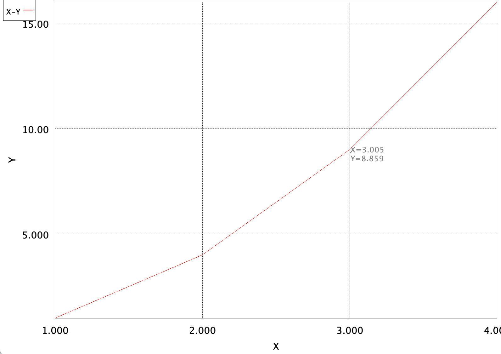
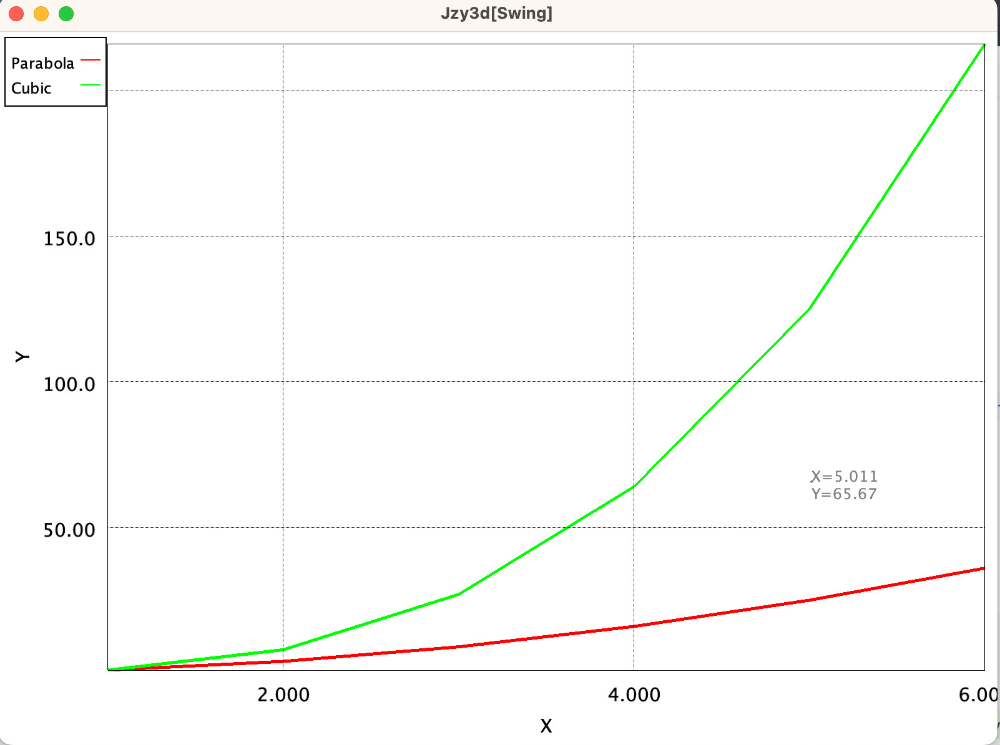
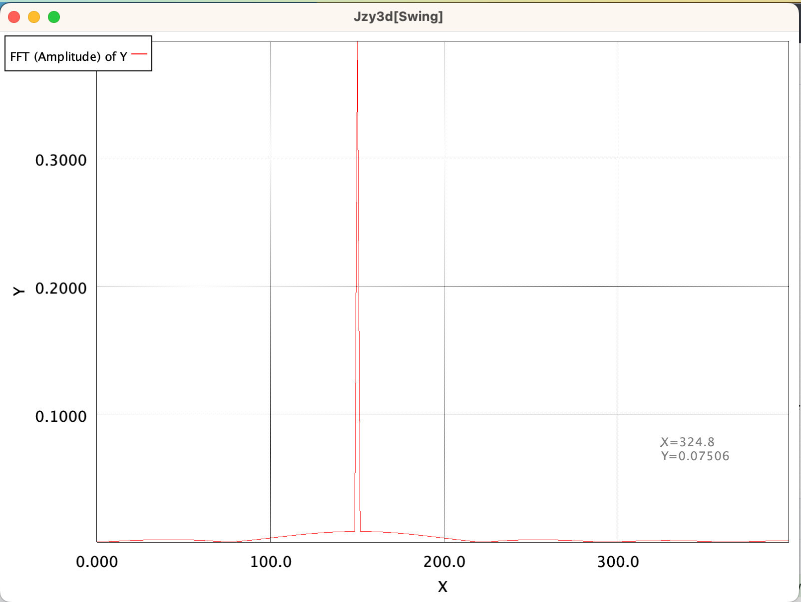
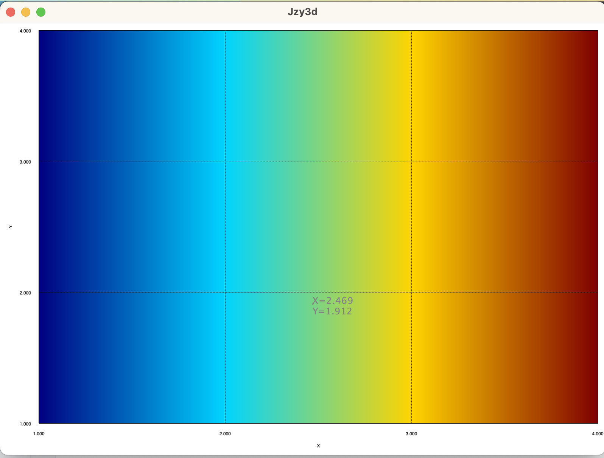
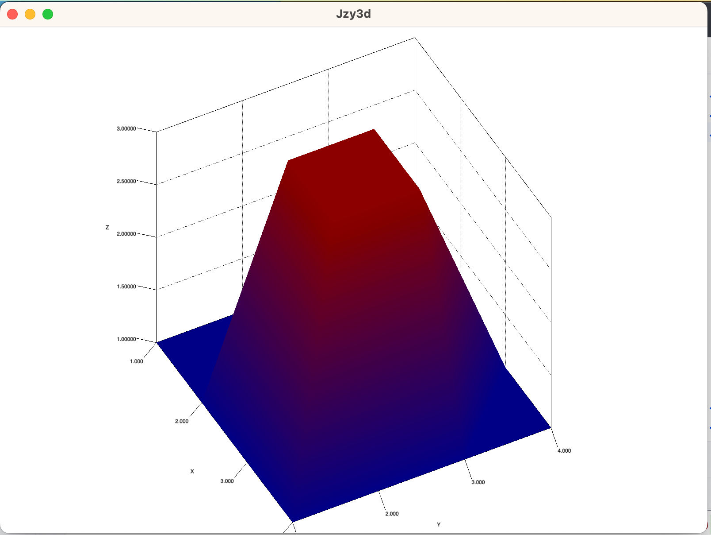
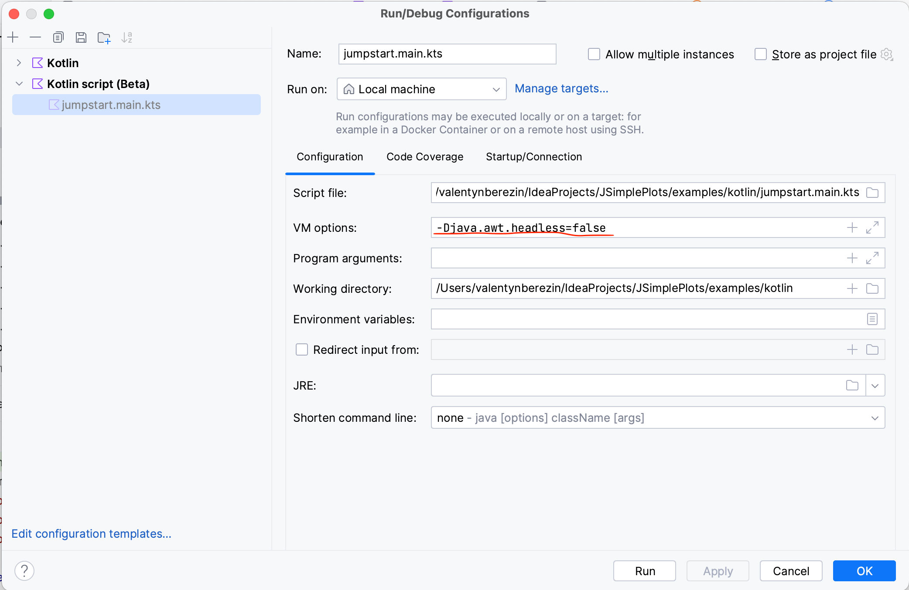

[](https://jitpack.io/#valb3r/JSimplePlots)

# What is this

This is simple plot helper library that uses [**awesome Jzy3D**](https://github.com/jzy3d/jzy3d-api) for all heavy lifting. The idea is to implement Fluent-API
that describes available actions is short and concise.

# Need to draw a plot from IntelliJ using Kotlin (or Java)?
[](https://www.youtube.com/watch?v=D9aX8-E5eY8)

# Need to draw a plot from terminal?
[](https://www.youtube.com/watch?v=X-sY0ijm6JA)

# Usage

## Add library

### Maven
```xml
<repositories>
    <repository>
        <id>jitpack.io</id>
        <url>https://jitpack.io</url>
    </repository>
    <repository>
        <id>maven.jzy3d.org</id>
        <url>https://maven.jzy3d.org/releases/</url>
    </repository>
</repositories>

<dependency>
    <groupId>com.github.valb3r.JSimplePlots</groupId>
    <artifactId>plots</artifactId>
    <version>0.0.5</version>
</dependency>
```

### Gradle
```groovy
repositories {
    maven { url 'https://jitpack.io' }
    maven { url 'https://maven.jzy3d.org/releases/' }
}

dependencies {
    implementation 'com.github.valb3r.JSimplePlots:plots:0.0.5'
}
```


# Examples

## Kotlin

## Plot directly from kotlin script:
(I.e. download `kscript` as described [here](https://github.com/kscripting/kscript), or run it from IntelliJ from file that has `.main.kts` extension, i.e. as [here](examples/kotlin/jumpstart.main.kts))
<!-- @embed-example-start:jumpstart:kotlin -->
```kotlin
@file:Repository("https://jitpack.io")
@file:Repository("https://maven.jzy3d.org/releases/")
@file:DependsOn("com.github.valb3r.JSimplePlots:plots:0.0.5")

import com.valb3r.jsimpleplots.plots.SimplePlots

SimplePlots.xy()
    .x(floatArrayOf(1.0f, 2.0f, 3.0f, 4.0f))
    .y(floatArrayOf(1.0f, 4.0f, 9.0f, 16.0f))
    .width(5)
    .plot()
```
<!-- @embed-example-end -->

## 2D plots

### Line (X-Y)

<!-- @embed-example-start:example-2d-xy:kotlin -->
```kotlin
SimplePlots.xy()
    .x(floatArrayOf(1.0f, 2.0f, 3.0f, 4.0f))
    .y(floatArrayOf(1.0f, 4.0f, 9.0f, 16.0f))
    .plot()
```
<!-- @embed-example-end -->

### Multiple plots (X-Y)

<!-- @embed-example-start:example-2d-xy-multiple:kotlin -->
```kotlin
val parabola = SimplePlots.xy()
    .x(floatArrayOf(1.0f, 2.0f, 3.0f, 4.0f, 5.0f, 6.0f))
    .y(floatArrayOf(1.0f, 4.0f, 9.0f, 16.0f, 25.0f, 36.0f))
    .width(5)
    .named("Parabola")
val cubic = SimplePlots.xy()
    .x(floatArrayOf(1.0f, 2.0f, 3.0f, 4.0f, 5.0f, 6.0f))
    .y(floatArrayOf(1.0f, 8.0f, 27.0f, 64.0f, 125.0f, 216.0f))
    .width(5)
    .named("Cubic")

SimplePlots.multiple()
    .add(parabola)
    .add(cubic)
    .plot()
```
<!-- @embed-example-end -->

### Fast-Fourier-Transform

<!-- @embed-example-start:example-2d-fft:kotlin -->
```kotlin
SimplePlots.fft()
    .y(data)
    .samplingFrequency(samplingFrequency)
    .plot()
```
<!-- @embed-example-end -->


## 3D plots

### Heatmap

<!-- @embed-example-start:example-heatmap:kotlin -->
```kotlin
SimplePlots.heatmap()
    .x(floatArrayOf(1.0f, 2.0f, 3.0f, 4.0f, 1.0f, 2.0f, 3.0f, 4.0f, 1.0f, 2.0f, 3.0f, 4.0f, 1.0f, 2.0f, 3.0f, 4.0f))
    .y(floatArrayOf(1.0f, 1.0f, 1.0f, 1.0f, 2.0f, 2.0f, 2.0f, 2.0f, 3.0f, 3.0f, 3.0f, 3.0f, 4.0f, 4.0f, 4.0f, 4.0f))
    .z(floatArrayOf(0.0f, 1.0f, 2.0f, 3.0f, 0.0f, 1.0f, 2.0f, 3.0f, 0.0f, 1.0f, 2.0f, 3.0f, 0.0f, 1.0f, 2.0f, 3.0f))
    .plot()
```
<!-- @embed-example-end -->

### Surface

<!-- @embed-example-start:example-3d-surface:kotlin -->
```kotlin
SimplePlots.surface()
    .x(floatArrayOf(1.0f, 2.0f, 3.0f, 4.0f, 1.0f, 2.0f, 3.0f, 4.0f, 1.0f, 2.0f, 3.0f, 4.0f, 1.0f, 2.0f, 3.0f, 4.0f))
    .y(floatArrayOf(1.0f, 1.0f, 1.0f, 1.0f, 2.0f, 2.0f, 2.0f, 2.0f, 3.0f, 3.0f, 3.0f, 3.0f, 4.0f, 4.0f, 4.0f, 4.0f))
    .z(floatArrayOf(1.0f, 1.0f, 1.0f, 1.0f, 1.0f, 3.0f, 3.0f, 1.0f, 1.0f, 3.0f, 3.0f, 1.0f, 1.0f, 1.0f, 1.0f, 1.0f))
    .plot()
```
<!-- @embed-example-end -->

### Fast fourier transform - waterfall (time domain + frequency domain)
<!-- @embed-example-start:example-fft-heatmap:kotlin -->
```kotlin
SimplePlots.waterfallFft()
    .y(data)
    .chunkSize(100)
    .samplingFrequency(samplingFrequency)
    .plot()
```
<!-- @embed-example-end -->


## Plot contents of CSV file usage example
```kotlin
@file:Repository("https://jitpack.io")
@file:Repository("https://maven.jzy3d.org/releases/")
@file:DependsOn("com.github.valb3r.JSimplePlots:plots:0.0.5")
@file:DependsOn("com.github.valb3r.JSimplePlots:data-adapters:0.0.5")

import com.valb3r.jsimpleplots.data_adapters.DataAdapter
import com.valb3r.jsimpleplots.plots.SimplePlots
import java.io.File


val tempFile = File.createTempFile("plots", "data")
tempFile.writeText(
    """
        X;Y
        1;1
        2;4
        3;9
        4;16
        5;25
    """.trimIndent()
)
val csv = DataAdapter.csv().of(tempFile)
SimplePlots.xy()
    .x(csv["X"].float())
    .y(csv["Y"].float())
    .plot()
```

## Java

## 2D plots

### Line (X-Y)
<!-- @embed-example-start:example-2d-xy:java -->
```java
SimplePlots.INSTANCE.xy()
        .x(new float[] {1.0f, 2.0f, 3.0f, 4.0f})
        .y(new float[] {1.0f, 4.0f, 9.0f, 16.0f})
        .plot();
```
<!-- @embed-example-end -->

### Multiple plots (X-Y)
<!-- @embed-example-start:example-2d-xy-multiple:java -->
```java
var parabola = SimplePlots.INSTANCE.xy()
        .x(new float[] {1.0f, 2.0f, 3.0f, 4.0f})
        .y(new float[] {1.0f, 4.0f, 9.0f, 16.0f})
        .named("Parabola");
var cubic = SimplePlots.INSTANCE.xy()
        .x(new float[] {1.0f, 2.0f, 3.0f, 4.0f})
        .y(new float[] {1.0f, 8.0f, 27.0f, 64.0f})
        .named("Cubic");

SimplePlots.INSTANCE.multiple()
        .add(parabola)
        .add(cubic)
        .plot();
```
<!-- @embed-example-end -->

### Fast fourier transform
<!-- @embed-example-start:example-2d-fft:java -->
```java
SimplePlots.INSTANCE.fft()
        .samplingFrequency(samplingFrequency)
        .y(data)
        .plot();
```
<!-- @embed-example-end -->

## 3D plots

### Heatmap
<!-- @embed-example-start:example-heatmap:java -->
```java
SimplePlots.INSTANCE.heatmap()
        .x(new float[] {1.0f, 2.0f, 3.0f, 4.0f, 1.0f, 2.0f, 3.0f, 4.0f, 1.0f, 2.0f, 3.0f, 4.0f, 1.0f, 2.0f, 3.0f, 4.0f})
        .y(new float[] {1.0f, 1.0f, 1.0f, 1.0f, 2.0f, 2.0f, 2.0f, 2.0f, 3.0f, 3.0f, 3.0f, 3.0f, 4.0f, 4.0f, 4.0f, 4.0f})
        .z(new float[] {1.0f, 1.0f, 1.0f, 1.0f, 1.0f, 3.0f, 3.0f, 1.0f, 1.0f, 3.0f, 3.0f, 1.0f, 1.0f, 1.0f, 1.0f, 1.0f})
        .plot();
```
<!-- @embed-example-end -->

### Surface
<!-- @embed-example-start:example-3d-surface:java -->
```java
SimplePlots.INSTANCE.surface()
        .x(new float[] {1.0f, 2.0f, 3.0f, 4.0f, 1.0f, 2.0f, 3.0f, 4.0f, 1.0f, 2.0f, 3.0f, 4.0f, 1.0f, 2.0f, 3.0f, 4.0f})
        .y(new float[] {1.0f, 1.0f, 1.0f, 1.0f, 2.0f, 2.0f, 2.0f, 2.0f, 3.0f, 3.0f, 3.0f, 3.0f, 4.0f, 4.0f, 4.0f, 4.0f})
        .z(new float[] {1.0f, 1.0f, 1.0f, 1.0f, 1.0f, 3.0f, 3.0f, 1.0f, 1.0f, 3.0f, 3.0f, 1.0f, 1.0f, 1.0f, 1.0f, 1.0f})
        .plot();
```
<!-- @embed-example-end -->

### Fast fourier transform - waterfall (time domain + frequency domain)
<!-- @embed-example-start:example-fft-heatmap:java -->
```java
SimplePlots.INSTANCE.waterfallFft()
        .y(data)
        .chunkSize(100)
        .samplingFrequency(samplingFrequency)
        .plot();
```
<!-- @embed-example-end -->

**!!! In case of java.awt.HeadlessException**: Add `-Djava.awt.headless=false` to JVM arguments

